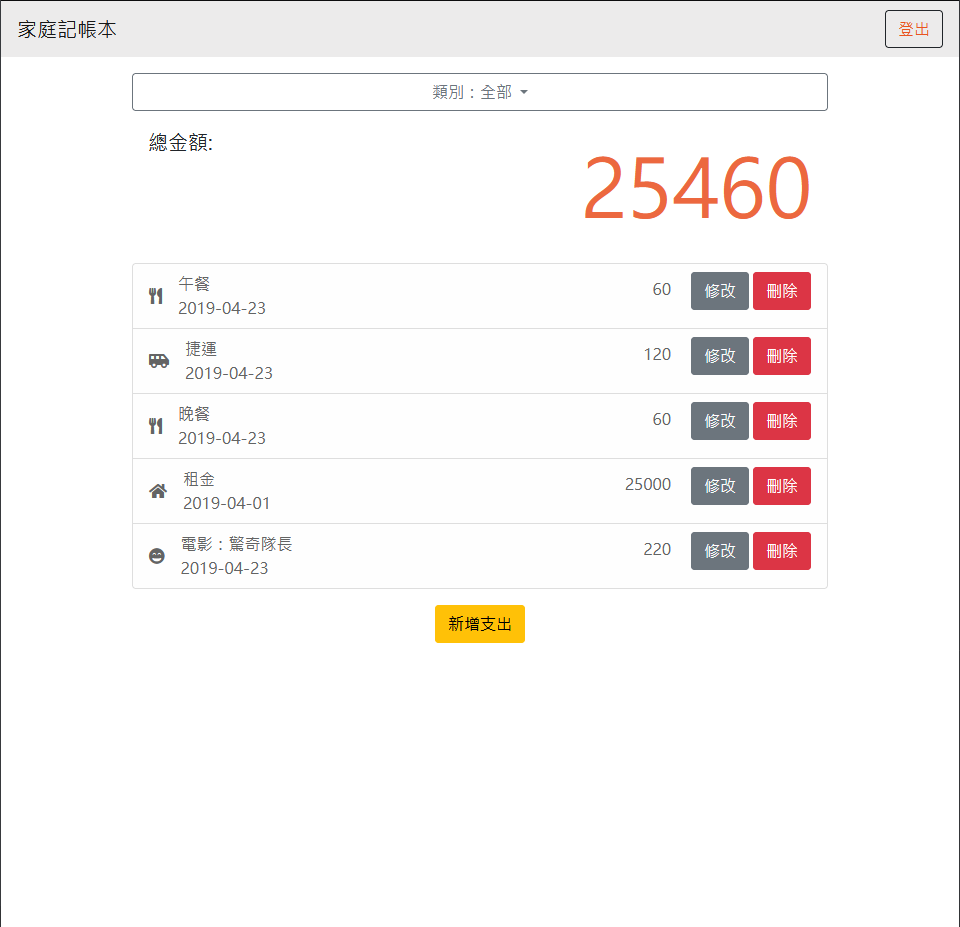

# 家庭記帳本

家庭記帳本是一個以Node.js和Express打造的網頁，可以記錄自己的支出。使用者需要註冊之後才能夠使用記帳本的功能。

## 首頁


## 功能

* 查看所有支出
* 新增支出
* 刪除支出
* 編輯支出
* 透過類別篩選支出

## 安裝與執行步驟

1. 安裝Node.js及npm
2. 把專案複製到本地
3. 在本地開啟之後，透過終端機進入資料夾，輸入：

   ```bash
   npm install
   ```

4. 產生種子資料，輸入：

   ```bash
   npm run seed
   ```

5. 產生種子資料完畢後，輸入：

   ```bash
   npm run start
   ```

6. 若看見此行訊息則代表順利運作：

   ```bash
   Express is listening on http://localhost:3000
   mongodb connected!
   ```

7. 若欲暫停使用，請按ctrl + c

## 測試資料
* 帳號
  * email: user1@example.com
  * 密碼: 12345678

## 開發工具

* Node.js 14.16.0
* Express 4.17.2
* Express-Handlebars 4.0.2
* Mongoose 6.1.6
* bcryptjs 2.4.3
* connect-flash 0.1.1
* dotenv 10.0.0
* passport 0.5.2
* passport-local 1.0.0
* Bootstrap 5.1.3
* Font-awesome Latest 5.x